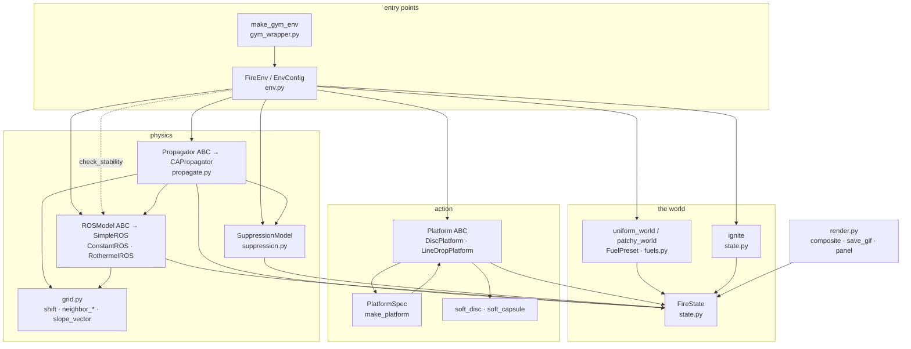

# swarmfire — building an environment, and what every class does

This document is the developer-facing companion to the README. The README says
*why* the design is the way it is; this one says *what to call*, *what each
class owns*, and *which other classes it touches*.

Two halves:

1. [Creating an environment](#1-creating-an-environment) — the recipes, from
   the one-liner to a fully hand-assembled env.
2. [The classes](#2-the-classes) — one section per class: what it owns, what
   it calls, what calls it, followed by a full trace of a single `step`.

---

## 1. Creating an environment

### 1.1 Install

```bash
pip install -e ".[viz,dev]"     # torch + numpy, plus matplotlib/imageio and pytest
pytest                          # 20-odd physics sanity checks, ~seconds on CPU
```

Extras: `viz` (rendering), `gym` (Gymnasium adapter), `real` (pyretechnics /
landfire, for the Rothermel work), `dev` (pytest).

### 1.2 The one-liner

```python
from swarmfire import FireEnv, EnvConfig

env = FireEnv("helicopter", config=EnvConfig(batch=64, grid=(192, 192), device="cuda"))
obs = env.reset()
out = env.rollout()                       # policy=None -> unsuppressed baseline
print(out["burned_ha"].mean())
```

`FireEnv.__init__` fills in every component you did not pass:

| argument | default it builds | swap it for |
|---|---|---|
| `platform` | `make_platform("helicopter")` | `"tanker"`, `"drone_swarm"`, or a `Platform` instance |
| `ros_model` | `SimpleROS()` | `RothermelROS()`, `ConstantROS()` |
| `suppression` | `SuppressionModel()` | a re-parameterised `SuppressionModel` |
| `propagator` | `CAPropagator(ros_model, suppression)` | any `Propagator` subclass |
| `config` | `EnvConfig()` | see below |

Note the wiring: **the propagator is constructed from the ROS model and the
suppression model you passed**. If you pass your own `propagator`, it must be
given its own `ros_model` / `suppression` — `FireEnv` will not inject them, and
`check_stability()` still asks `self.ros_model`, so keep them consistent.

### 1.3 `EnvConfig`, field by field

```python
EnvConfig(
    batch=8, grid=(128, 128), cell_size=30.0, dt=5.0, horizon=400,
    preset="grass", wind=(4.0, 0.0), slope=(0.0, 0.0),
    heterogeneous=False, ignition=None, dispatch_s=0.0,
    device="cuda" if available else "cpu",
    water_cost_per_kl=0.02, seed=None,
)
```

| field | meaning | notes |
|---|---|---|
| `batch` | independent fires advanced in lockstep | the dimension that fills the GPU; nothing loops over it |
| `grid` | `(H, W)` cells | 192² at 30 m ≈ 33 km² |
| `cell_size` | metres per cell | 30 m matches LANDFIRE rasters |
| `dt` | seconds per step | must satisfy `check_stability()` |
| `horizon` | steps before `done` | wall-clock episode length is `horizon * dt` |
| `preset` | `"grass"`, `"shrub"`, `"timber"` | **ignored when `heterogeneous=True`** |
| `wind` | `(east, north)` m/s at midflame height | drives both spread rate and ellipse shape |
| `slope` | `(dz/deast, dz/dnorth)`, dimensionless | `(0.3, 0)` is a 30 % grade rising east |
| `heterogeneous` | use `patchy_world` instead of `uniform_world` | consumes `seed`, ignores `preset` |
| `ignition` | `(y, x)` cell | `None` → grid centre |
| `dispatch_s` | seconds before the fleet may release | **only applied when `platform` is passed as a string** — a pre-built `Platform` keeps its own `spec.dispatch_s` |
| `device` | `"cpu"` / `"cuda"` | every tensor is allocated here |
| `water_cost_per_kl` | reward penalty per kL of water | in hectares-equivalent |
| `seed` | seed for the patchy fuel field | only read when `heterogeneous=True` |

### 1.4 Picking a platform

```python
from swarmfire import make_platform

env = FireEnv("tanker",      config=cfg)   # LineDropPlatform, retardant, 12 kL, 30 min reload
env = FireEnv("helicopter",  config=cfg)   # DiscPlatform,     water,      3 kL, 10 min reload
env = FireEnv("drone_swarm", config=cfg)   # DiscPlatform,     water, 32 × 20 L, 2 min reload
```

`make_platform` also takes overrides, which are split in two: keys matching a
`PlatformSpec` field are respec'd, geometry keys go to the platform class.

```python
swarm = make_platform("drone_swarm", n_agents=64, reload_s=90, radius_m=8.0)
env   = FireEnv(swarm, config=EnvConfig(dispatch_s=600))   # <- dispatch_s NOT applied here
```

To get a dispatch delay on a hand-built platform, put it in the spec:

```python
swarm = make_platform("drone_swarm", n_agents=64, dispatch_s=600)
```

### 1.5 Hand-assembling every component

```python
from swarmfire import (FireEnv, EnvConfig, SimpleROS, CAPropagator,
                       SuppressionModel, make_platform)

ros  = SimpleROS(wind_a=2.5, wind_b=1.5, slope_c=5.5)
supp = SuppressionModel(water_to_moisture=0.8, water_tau_fire=60.0, retardant_efficacy=0.95)
prop = CAPropagator(ros, supp, pnorm=6.0, arrival_softness=0.08)

env = FireEnv(
    platform=make_platform("tanker", dispatch_s=1800),
    ros_model=ros,
    suppression=supp,
    propagator=prop,
    config=EnvConfig(batch=32, grid=(256, 256), dt=3.0, wind=(6.0, 1.0), device="cuda"),
)
```

### 1.6 A world without an environment

`FireEnv` is a convenience shell. The physics runs perfectly well on a bare
`FireState`, which is what the true free-burn baseline in
`scripts/suppression_study.py` does — no platform exists, so nothing can leak
suppressant into the run:

```python
from swarmfire import uniform_world, ignite, CAPropagator, SimpleROS, SuppressionModel

state = uniform_world(batch=4, grid=(192, 192), preset="grass", wind=(5.0, 2.0), device="cuda")
state = ignite(state, 96, 96)
prop  = CAPropagator(SimpleROS(), SuppressionModel())

for _ in range(2000):
    state = prop.step(state, dt=4.0).detach()

print(state.burned_area())   # [B] hectares
```

This matters because `env.rollout(policy=None)` is **not** a true free burn:
`zero_action()` sets the release channel to `-1`, and `Platform.step` maps it
through `sigmoid(4 * a)`, so the floor is `sigmoid(-4) ≈ 1.8 %` of capacity per
step. It is a very weak, badly aimed drizzle, not zero.

### 1.7 Shapes: observations, actions, reward

```python
obs = env.reset()
obs["grid"]     # [B, 12, H, W]  — state.stack(), channels in state.OBS_LAYERS order
obs["fleet"]    # [B, N, 5]      — y, x (both in [-1,1]), load frac, cooldown frac, dispatch frac

env.action_dim  # 3, or 4 for the tanker (extra channel = drop-line bearing)
env.n_agents    # spec.n_agents: 1 for tanker/helicopter, 32 for the swarm

action = torch.zeros(B, env.n_agents, env.action_dim)   # all channels in [-1, 1]
# [..., 0] target y   [..., 1] target x   [..., 2] release   [..., 3] heading (tanker only)

obs, reward, done, info = env.step(action)
# reward [B] = -(hectares newly burned) - water_cost_per_kl * (kL of water released)
# done   [B] = fire out (total intensity < 1e-3) or step >= horizon
# info        burned_ha, active, extinguished, step
```

`OBS_LAYERS` = `DYNAMIC_LAYERS` (`fuel, moisture, intensity, burned, ignition,
water, retardant`) + `STATIC_LAYERS` (`elevation, fuel_model, ros0,
moisture_ext, burn_rate`) — 12 channels. Index into it by name rather than by
number:
`OBS_LAYERS.index("intensity")`.

Retardant is not charged for in the reward; only the water field is.

### 1.8 Rollouts, RL and differentiable modes

```python
# scalar-reward RL: detach=True (default), no graph accumulates
out = env.rollout(policy=my_policy, detach=True)

# differentiable simulation: gradients flow from burned area back into the action
env.reset()
drop = torch.zeros(B, env.n_agents, env.action_dim, device=dev, requires_grad=True)
obs = env.observe()
for _ in range(60):                       # truncated-BPTT window
    obs, _, _, _ = env.step(drop, detach=False)
env.state.burned_area().sum().backward()
print(drop.grad)                          # non-zero: move the drop 15 m north
env.state = env.state.detach(); env.platform.detach()   # before the next window
```

`detach=True` calls both `FireState.detach()` and `Platform.detach()` — the
fleet carries position/load/cooldown across steps and would otherwise build a
graph for the whole episode.

### 1.9 Always check stability

```python
limit, ok = env.check_stability()      # (max safe dt in seconds, is cfg.dt safe)
```

The explicit CA step is conditionally stable: the front must not cross a cell
in one timestep. Re-check after changing wind, fuel, or `cell_size`. An
unstable run looks like a fire spreading faster than any wind justifies.

### 1.10 Gymnasium

```python
from swarmfire.gym_wrapper import make_gym_env
gym_env = make_gym_env("helicopter", EnvConfig(grid=(128, 128)))
```

Forces `batch=1` and converts to numpy every step. Use it to cross-check
against a known-good PPO implementation, never for a real training run.

---

## 2. The classes

### 2.1 Dependency graph



Arrows point from caller to callee. Nothing in `physics` or `world` imports
anything from `entry` — the dependency graph is acyclic and one-directional,
which is what makes each seam swappable in isolation.

### 2.2 `FireState` — `state.py`

**Owns.** The entire world as a frozen-ish dataclass of `[B, H, W]` float32
rasters sharing one grid: seven dynamic layers (`fuel, moisture, intensity,
burned, ignition, water, retardant`), five static ones (`elevation, fuel_model, ros0,
moisture_ext, burn_rate`), plus `wind [B,2]`, `cell_size` (a float, not a
tensor) and `t [B]` elapsed seconds.

**Key methods.** `stack(layers)` → `[B, C, H, W]` for a conv net ·
`replace(**changes)` functional update that keeps the autograd graph ·
`detach()` / `to(device)` · `burned_area()` → `[B]` hectares · `active()` →
`[B]` total intensity · properties `batch`, `grid`, `device`, `cell_area`.

**Calls.** Nothing but torch. It is the leaf of the dependency graph — this is
deliberate, and the reason new physics means a new channel here rather than a
new code path elsewhere.

**Called by.** Everything. `FireEnv` holds one; `CAPropagator`, `SimpleROS`,
`SuppressionModel`, `Platform` and `render` all read it and return new
instances via `replace`.

**Module-level `ignite(state, y, x, radius=1.5)`.** Adds a soft Gaussian blob
to `ignition` (×1.5, i.e. past the arrival threshold) and to `intensity`, so
the very first step has something to spread from. Soft rather than a single hot
cell so fire shape and gradients do not depend on grid alignment. Called by
`FireEnv.reset`.

### 2.3 `FuelPreset` and the world builders — `fuels.py`

**`FuelPreset`** (frozen dataclass): `name, ros0, moisture_ext, residence,
moisture`, plus `burn_rate = 1 / residence`. Three registered in `PRESETS`:
`grass` (fast, dries early), `shrub`, `timber` (slow, wet).

**`uniform_world(...)` → `FireState`.** Allocates every layer, paints a planar
slope into `elevation` from the `slope` argument, broadcasts the preset's
scalars into per-cell rasters. This is the only place a `FireState` is
constructed from nothing.

**`patchy_world(...)` → `FireState`.** Calls `uniform_world`, then builds a
smooth random field (coarse uniform noise bicubically upsampled), bins it into
the given presets, and `replace`s `ros0 / moisture_ext / burn_rate / moisture`
with the per-cell mixture. Exists so a controller cannot learn to exploit the
symmetry of a homogeneous bed.

**Called by.** `FireEnv.reset` picks one based on `cfg.heterogeneous`.

### 2.4 `grid.py` — geometry (functions, no classes)

`NEIGHBOR_OFFSETS` fixes the Moore-neighbour order that every `[B, 8, H, W]`
direction tensor in the package follows; `N_DIRS = 8`.

* `neighbor_angles()` → `[8]` bearings, `atan2(north, east)` — used by `SimpleROS`.
* `neighbor_distances(cell_size)` → `[8]` metres — used by `CAPropagator.ignition_drive` and `ROSModel.max_stable_dt`.
* `shift(x, dy, dx)` — the stencil. Zero-padded, so the domain edge behaves as non-fuel instead of wrapping the fire around the map.
* `slope_vector(elevation, cell_size)` → `[B, 2, H, W]` central-difference terrain gradient — used by `SimpleROS._drive`.

**Calls.** torch only. **Called by** `propagate.py`, `ros/simple.py`,
`ros/base.py`.

### 2.5 `ROSModel` (ABC) — `ros/base.py`

**The seam that makes the project's realism roadmap a one-line change.**
Contract: `__call__(state) -> [B, 8, H, W]` spread rates in m/s, one per Moore
direction, in `NEIGHBOR_OFFSETS` order. Nothing downstream knows how the number
was produced.

`max_stable_dt(state, courant=0.4)` is concrete on the base class: it evaluates
`self(state)`, divides by `neighbor_distances`, and returns `courant / peak`.
Called by `CAPropagator.max_stable_dt` and by `FireEnv.check_stability`.

**Implementations.**

* **`ConstantROS(speed)`** — isotropic constant. Test fixture only.
* **`SimpleROS`** — the working default (§2.6).
* **`RothermelROS`** — Rothermel (1972) surface spread over the standard fuel
  models, batched and differentiable, agreeing with `pyretechnics` to float32.
  Reads `FireState.fuel_model` (a fuel model number per cell, which is what a
  LANDFIRE raster contains) and `FireState.moisture` (dead 1-hour, the layer
  suppression raises); the coarser and live moisture classes are constructor
  arguments because they are weather rather than fuel. Build worlds for it with
  `fuels.rothermel_world`, which also fills `ros0`, `moisture_ext` and
  `burn_rate` from the same model so the propagator agrees with it.

  Filling this slot in was the "get realistic" step, and it touched nothing
  outside `ros/`, `fuel_models.py` and one new `FireState` layer - which was the
  point of putting a seam here in the first place.

### 2.6 `SimpleROS` — `ros/simple.py`

Not Rothermel, but the same *shape* as Rothermel, in three stages:

1. `_drive(state)` — the wind factor `a·U^b` and the slope factor `c·tan(φ)²`
   are added **as vectors**, not as scalars, so a fire pushed north by wind and
   east by terrain runs northeast (the FARSITE construction). Returns
   `(magnitude, heading)`, both `[B, H, W]`. Calls `grid.slope_vector`.
2. `__call__` — head rate is `state.ros0 * (1 + magnitude)`.
3. The ellipse — it inverts the wind factor to an *effective* wind `u_eff`, gets
   the length-to-breadth ratio from `length_to_breadth` (Alexander 1985, exactly
   1.0 at zero wind), converts to eccentricity, and evaluates the polar form of
   an ellipse with the ignition point at a focus against
   `grid.neighbor_angles`. Head, flank and backing rates all derive from one
   head rate.

Skipping stage 3 gives square fires and a controller that learns nothing
transferable. `max_eccentricity` caps the cigar shape at extreme wind purely
for numerical sanity.

**Calls.** `grid.slope_vector`, `grid.neighbor_angles`, `length_to_breadth`,
`FireState`. **Called by.** `CAPropagator.step`, `ROSModel.max_stable_dt`.

### 2.7 `SuppressionModel` — `suppression.py`

A dataclass of constants plus four methods. The central design claim:
**suppressant is not a special case in the fire model**, it acts through fuel
moisture, which the spread physics already depends on.

| method | does | called by |
|---|---|---|
| `effective_moisture(state)` | `moisture + water_to_moisture * water` | `flammability` |
| `flammability(state)` | `[B,H,W]` in [0,1]: sigmoid gate around `moisture_ext`, times `1 - retardant_efficacy * retardant`. **The only channel through which suppression touches spread.** | `CAPropagator.step` (twice — once on the drive, once on combustion) |
| `update(state, dt)` | evaporates water (`1/τ_ambient + intensity/τ_fire`, so flame boils it off in minutes) and ages retardant (τ = 12 h) | last line of `CAPropagator.step` |
| `deposit(state, water, retardant)` *(static)* | adds platform output into the layers; retardant clamped to 1 | `FireEnv.step`, deliberately kept out of `update` so the policy's action enters the state at one identifiable point |

Water and retardant differ exactly as they do operationally: water is strong
and boils off, retardant is weaker, persists for hours, and is not consumed by
the fire. That asymmetry is the whole control problem. `softness` keeps the
extinction transition differentiable — set it small, never zero, or gradients
through the suppression decision vanish.

**Calls.** `FireState` only. **Called by.** `CAPropagator` (constructor
argument), `FireEnv`.

### 2.8 `Propagator` (ABC) and `CAPropagator` — `propagate.py`

**Contract.** `step(state, dt) -> FireState`. One stencil plus elementwise
algebra, no Python loop over the batch.

**`CAPropagator(ros_model, suppression, pnorm=6, arrival_softness=0.08,
fuel_floor=0.03, fuel_softness=0.03)`** — holds references to a `ROSModel` and
a `SuppressionModel`, which is where the two seams get plugged together.

| method | does |
|---|---|
| `ignition_drive(state, ros)` | `[B,H,W]` rate at which the front closes on each cell. A neighbour at distance `L` burning at intensity `I` and spreading at `R` contributes `I·R/L`, so `ignition` reaches 1 after exactly the physical travel time `L/R`. Neighbour contributions combine with a **smooth p-norm**, not a sum — summing would let a cell with three lit neighbours ignite three times too fast, showing up as corners of the fire outrunning the flanks. Spelled as `torch.linalg.vector_norm`, *not* as `.pow(p).sum().pow(1/p)`: the two agree forward, but the hand-rolled form differentiates to infinity at a cell with no lit neighbour and put a NaN through the backward pass of every rollout. Calls `grid.shift` and `grid.neighbor_distances`. |
| `combustion(state, flammability)` | `[B,H,W]` intensity = `soft_gate(ignition, 1) · soft_gate(fuel, fuel_floor) · flammability`. `soft_gate` is a sigmoid normalised to reach **exactly** zero — a plain sigmoid leaves every unlit cell smouldering at `3.7e-6` and, worse, leaves a cell with *no fuel left* at `0.269`, which kept driving its neighbours forever. The flammability factor is why water on an *already burning* cell puts it out, and why the cell relights once the water evaporates if fuel remains. |
| `step(state, dt)` | the sequence in §2.12 |
| `max_stable_dt(state)` | passthrough to `self.ros_model.max_stable_dt` |

**Why `ignition` exists at all.** The tempting alternative — integrate
`intensity` with a self-feeding term — is autocatalytic: any cell that picks up
a trace bootstraps itself to fully alight on a timescale set by the feedback
gain, not by the ROS you computed. Measured at 6 m/s wind that formulation ran
the head 4× and the flanks 70× too fast. The progress variable removes that
feedback loop.

**It does not on its own make the front speed right, either.** Arrival used to
be paced by the neighbour's `intensity`, which is the rate that cell consumes
fuel and collapses on the flame residence timescale - 13 s for grass against the
100 s the front needs to cross a 30 m cell. Front speed therefore depended on
`burn_rate` and on `cell_size`, and once the smouldering floors came out of
`combustion` the front stopped moving altogether. `front_source` now supplies a
*has-ignited* gate instead, and measured front speed is flat across residence
times from 10 s to infinity and across cell sizes from 10 m to 45 m
([`VALIDATION.md`](VALIDATION.md) §2.1). The price is that a burnt-out cell keeps
radiating, so a barrier whose suppressant has evaporated can be crossed with
nothing burning against it - bounded at hours, and removed by a
minimum-arrival-time scheme. The p-norm is the remaining defect of the same
family: at `pnorm=6` the flanks run 33 % fast, and no value fixes the flanks
without breaking the head.

**Calls.** `ROSModel`, `SuppressionModel`, `grid.shift`,
`grid.neighbor_distances`, `FireState.replace`. **Called by.** `FireEnv.step`,
and directly by `scripts/suppression_study.py` for the true free burn.

### 2.9 `PlatformSpec`, `Platform` and subclasses — `platforms.py`

**`PlatformSpec`** (frozen dataclass) — the operational envelope, and nothing
else: `name, capacity_l, reload_s, cruise_ms, agent ("water"|"retardant"),
n_agents, dispatch_s`. Three constants: `TANKER`, `HELICOPTER`, `DRONE_SWARM`.

**`Platform` (ABC)** — a fleet of `n_agents` identical vehicles, batched over
`B` worlds. Fleet state lives here, *not* in `FireState`: `position [B,N,2]`
(y, x in cells), `load [B,N]` litres, `cooldown [B,N]` seconds.

| method | does | notes |
|---|---|---|
| `reset(batch, grid, device)` | vehicles at grid centre, tanks full, cooldown zero | called by `FireEnv.reset` |
| `action_dim` | 3 (`LineDropPlatform` overrides to 4) | read by `FireEnv.action_dim` |
| `on_station(state)` | `[B,N]` 0/1 — has `state.t` passed `dispatch_s`? | hard gate, by nature |
| `dispatch_fraction(state)` | `[B,N]` share of the delay still to run, 1 → 0 | fed to the policy as an observation channel, so it can tell *why* its early drops do nothing |
| `footprint(action, state)` *(abstract)* | `[B,N,H,W]` unit-mass deposition shapes | supplied by subclasses |
| `step(action, state, dt)` | the whole vehicle model, see below | returns `(water_mm, retardant_frac)`, both `[B,H,W]` |
| `detach()` | cuts the graph on position/load/cooldown | called by `FireEnv.step` when `detach=True` |

**`Platform.step` in order:** clamp the action → map channels 0,1 to a target
cell and fly toward it, capped at `cruise_ms * dt / cell_size` → compute
released volume from `sigmoid(4·release) × ready(cooldown) × remaining load` →
zero it if not `on_station` (so the tank does not drain and the reload clock
does not start before dispatch — the fleet arrives full) → treat a tank below
2 % as empty (the soft release gate always leaves a sliver, and without this a
vehicle never goes to reload) → tick the cooldown, refill on expiry → call
`self.footprint(...)` and turn litres into a depth field
`volume × shape / cell_area` → route to the retardant channel (normalised by
`RETARDANT_FULL_COVERAGE_MM`, clamped to 1) or the water channel per
`spec.agent`.

**Subclasses.**

* **`DiscPlatform(spec, radius_m)`** — point delivery: helicopter buckets, drone
  payloads. `footprint` calls `soft_disc`.
* **`LineDropPlatform(spec, length_m, width_m)`** — fixed-wing: a long narrow
  line along the flight path. `action_dim` is 4; channel 3 × π is the drop-line
  bearing. `footprint` calls `soft_capsule`.

**Footprint functions.** `soft_disc(centers, radius_cells, grid, softness)` and
`soft_capsule(centers, heading, length_cells, width_cells, grid, softness)`
both return `[B, N, H, W]` **unit-mass** shapes (each normalised to sum 1) built
from continuous coordinates with sigmoid edges — hence differentiable with
respect to drop position and heading. A policy gets a gradient telling it to
move a drop fifteen metres north.

**`make_platform(kind, **overrides)`** — the factory. Splits overrides: keys
that are `PlatformSpec` fields go through `_respec`, the rest (`radius_m`,
`length_m`, `width_m`) go to the class constructor. Raises `ValueError` on an
unknown kind.

**Calls.** `soft_disc` / `soft_capsule`, `FireState` (for `grid`, `cell_size`,
`t`, `cell_area`). **Called by.** `FireEnv.__init__` (via `make_platform`),
`FireEnv.reset`, `FireEnv.observe`, `FireEnv.step`.

### 2.10 `EnvConfig` and `FireEnv` — `env.py`

**`FireEnv`** is the assembly point and the only stateful orchestrator. It
holds `cfg`, `platform`, `suppression`, `ros_model`, `propagator`, the current
`state`, a step counter, and `_prev_burned` for the reward difference.

| method | does | calls |
|---|---|---|
| `__init__` | fills in missing components | `make_platform`, `SuppressionModel`, `SimpleROS`, `CAPropagator` |
| `reset()` | builds a world, lights it, resets the fleet, returns the first observation | `fuels.uniform_world` / `fuels.patchy_world`, `state.ignite`, `Platform.reset`, `FireState.burned_area`, `self.observe` |
| `observe()` | `{"grid": [B,11,H,W], "fleet": [B,N,5]}` | `FireState.stack`, `Platform.position/load/cooldown`, `Platform.dispatch_fraction` |
| `action_dim` / `n_agents` | passthroughs | `Platform.action_dim`, `spec.n_agents` |
| `zero_action()` | a `[B,N,A]` action with release at −1 | — (see §1.6: this is a drizzle, not silence) |
| `step(action, detach=True)` | one timestep → `(obs, reward, done, info)` | see §2.12 |
| `rollout(policy, steps, detach, record)` | loop to the horizon or until every fire is out; `policy=None` runs `zero_action` | `self.step`, `FireState.stack` when recording |
| `check_stability()` | `(max safe dt, is cfg.dt safe)` | `ROSModel.max_stable_dt` |

### 2.11 `render.py` and `gym_wrapper.py`

**`render`** — read-only, no classes. `composite(layers, index)` builds an
`[H,W,3]` RGB view by alpha-blending fuel/burned/water/retardant/flame from a
stacked tensor (it indexes channels through `OBS_LAYERS`, so adding a layer at
the end is safe). `draw_platforms` marks each vehicle as a haloed cross dimmed
in proportion to remaining load — without it the reload cycle is invisible and
the fleet appears to teleport between splashes. `save_png`, `save_gif`
(consumes `rollout(record=True)` frames) and `panel` need the `viz` extra.

**`gym_wrapper.make_gym_env(platform, config)`** — closes over a
`SingleFireEnv(gym.Env)` that forces `cfg.batch = 1`, exposes a Dict
observation space and a `Box(-1, 1, (N, A))` action space, unsqueezes the
action to a batch of one, splits `done` into `terminated` / `truncated` against
the horizon, and renders through `render.composite`. Everything moves to numpy
each step and the batch dimension — the thing that makes the simulator fast —
is thrown away, so it is a cross-check, not a training path.

### 2.12 One `step`, end to end

`FireEnv.step(action, detach=True)`:

1. **`Platform.step(action, state, dt)`** → `(water, retardant)`, each `[B,H,W]`
   * `Platform.on_station(state)` — reads `state.t` against `spec.dispatch_s`
   * `self.footprint(action, state)` → `soft_disc` or `soft_capsule`
2. **`SuppressionModel.deposit(state, water, retardant)`** → `state.replace(...)`
3. **`CAPropagator.step(state, dt)`**
   1. `SuppressionModel.flammability(state)` → `effective_moisture(state)`
   2. `ros_model(state)` → `SimpleROS.__call__` → `_drive` → `grid.slope_vector`;
      then `length_to_breadth` and `grid.neighbor_angles`
   3. `ignition_drive(state, ros)` → `grid.neighbor_distances`, 8 × `grid.shift`,
      p-norm over directions
   4. `ignition += dt * drive * flammability` → `state.replace`
   5. `combustion(state, flammability)` → new `intensity`
   6. `consumed = min(dt * intensity * burn_rate, fuel)`; update `fuel`,
      `burned`, `t` → `state.replace`
   7. `SuppressionModel.update(state, dt)` — evaporate water, age retardant
4. **if `detach`**: `FireState.detach()` and `Platform.detach()`
5. **reward** — `state.burned_area()` minus the previous value, minus
   `water_cost_per_kl × kL` (water only)
6. **done** — `state.active() < 1e-3`, or the step counter has reached the horizon
7. **`self.observe()`** → the returned observation

Read top to bottom, that is the entire simulator.

---

## 3. Extending it

| you want | do this | nothing else moves |
|---|---|---|
| a correct front speed | **do this first** — see [`VALIDATION.md`](VALIDATION.md) §2. Decouple arrival from `intensity`; replace the p-norm with a fastest-path update | `Propagator` contract is unchanged |
| real fire physics | **done** — `RothermelROS` plus `fuels.rothermel_world` | pass `ros_model=RothermelROS()` |
| real landscapes | load a LANDFIRE fuel-model raster into `FireState.fuel_model` and a DEM into `elevation` | `RothermelROS` already reads both |
| real landscapes | load LANDFIRE rasters into `fuels.py` instead of `PRESETS` | `FireState` layout is unchanged |
| a new front geometry | subclass `Propagator` (level set, minimum arrival time) — keep everything smooth | `FireEnv` takes it as `propagator=` |
| a new vehicle | add a `PlatformSpec`, subclass `Platform`, implement `footprint`, register it in `make_platform` | the physics never learns it exists |
| a new suppressant | add a layer to `DYNAMIC_LAYERS`, a decay term to `SuppressionModel.update`, a factor to `flammability` | the coupling stays a single scalar gate |

## 4. Invariants worth not breaking

* **No Python loop over the batch, ever.** `B` is what fills the GPU.
* **Every gate is smooth.** No boolean fire state anywhere in the physics. This
  is the one choice that is genuinely expensive to retrofit — a hard threshold
  anywhere in the chain kills the gradient for everything upstream of it.
* **Hard gates are confined to the fleet.** Reload, empty-tank and dispatch are
  non-differentiable by nature; drop position, heading, volume and all of the
  physics are smooth.
* **State updates go through `FireState.replace`.** In-place mutation of a
  layer breaks the autograd graph.
* **Suppression touches the physics through exactly one number**,
  `SuppressionModel.flammability`.
* **`check_stability()` after any change to wind, fuel, or resolution.**
* **Re-run `scripts/validate_pyretechnics.py` after any change to `ros/` or
  `propagate.py`**, and read `tests/test_validation.py` — its tolerances are
  measurements of the current disagreement, so one of them failing means a
  number moved, not that you broke something. Look at which way it moved.
