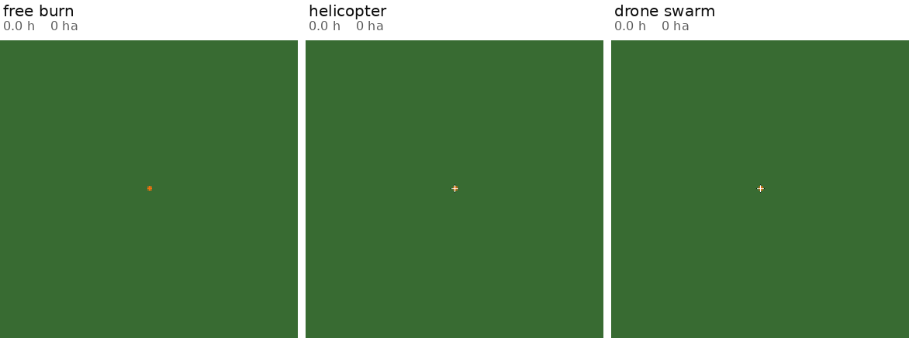

# swarmfire

Differentiable, GPU-batched wildfire propagation with suppressant dynamics, and
a platform abstraction for delivering that suppressant under realistic
operational constraints.

The current dynamics are a simple Rothermel Rate-Of-Spead fire propagation model, with simple moisture accumulation mechanisms for fire suppression. The goal is to progressively increment to more and more realistic simulations, while allowing for learnt aircraft strategies.

This is a baseground for the development of an optimal automatic drone-based wildfire response, with the target of being operational on real events.

## Visualization 



The same fire under three regimes, sharing one ignition and one clock: grass,
wind (5, 2) m/s, 192 × 192 cells at 30 m, 2.8 hours. The fleet is grounded for
the first ten minutes (`dispatch_s = 600`), so all three panels are identical
until it launches. The white cross is the vehicle, dimming as its tank empties
and brightening on reload. Regenerate with:

```bash
python scripts/suppression_study.py compare --dispatch 600 --upscale 2 --record-every 20
```

## How to get the code running ?

```bash
pip install -e ".[viz,dev]"
python scripts/demo.py --device cuda
pytest
```

```python
from swarmfire import FireEnv, EnvConfig

env = FireEnv("drone_swarm", config=EnvConfig(batch=256, grid=(192, 192), device="cuda"))
env.reset()
print(env.rollout()["burned_ha"].mean())   # unsuppressed baseline
```

## Related work

This work is a proposition to bridge different (currently isolated) aspects of wildfire mitigation, in order to discover optimal wildfire response strategies. In the next table, we make an inventory of existing works :

| work | fire spread model | suppressant → fire coupling | delivery / platform realism | learned or optimised strategy | differentiable | batched · GPU | code available |
|---|---|---|---|---|---|---|---|
| Dada & Barakos 2025 — real-time CFD of aerial firefighting [1] | ✗ | ✗ | ✓ resolved drop breakup and fall | ✗ (pilot training) | ✗ | ✗ | ✗ |
| Calbrix et al. 2023 — CFD drops, CL-415 and Dash-8 [2] | ✗ | ✗ | ✓ per-airframe drop simulation | ✗ | ✗ | ✗ | ✗ |
| Wu et al. 2024 — review of airtanker drop characteristics [3] | ✗ | ◐ surveys effectiveness studies | ✓ survey of drop patterns | ✗ | ✗ | ✗ | n/a (review) |
| Lovellette — AT-802 ground pattern guide [4] | ✗ | ✗ | ✓ measured coverage-level footprints | ✗ | ✗ | ✗ | n/a (field data) |
| Plucinski & Sullivan 2024 — combustion wind tunnel [5] | ◐ bench-scale flame spread | ✓ measured, direct *and* indirect attack | ✗ (applied by hand) | ✗ | ✗ | ✗ | n/a (experimental) |
| Martins et al. 2026 — water drops on wildfire spread [6] | ✓ | ✓ | ◐ drop as a prescribed footprint | ✗ | ✗ | ✗ | ? |
| Murray et al. 2024 — deep RL for firebreak placement [7] | ✓ | ✗ (firebreaks, not suppressant) | ✗ (no platform, no logistics) | ✓ trained DRL policy | ✗ (RL through a black-box sim) | ◐ | ? |
| Matei et al. 2026 — aerial suppression planning, hybrid CNN–CA [8] | ◐ frozen CNN emits the CA's parameters | ◐ water *and* retardant, but multiplied onto a surrogate never trained on drops | ✓ 18-airframe fleet, real capacities and turnaround | ◐ 3,000 Adam steps per scenario, no policy | ✓ | ◐ vectorised over 300 MC samples | ✗ |
| **swarmfire (this work)** | ✓ explicit smooth CA, Rothermel-shaped ROS | ✓ through fuel moisture against moisture of extinction | ◐ three generic classes: capacity, footprint, reload, transit | ◐ RL + gradient interfaces ready, no trained policy yet | ✓ end-to-end through hundreds of steps | ✓ `[B,H,W]` tensor ops | ✓ |

✓ does it · ◐ partially · ✗ does not · ? not established from the source

Most of these works are excellent in one column and silent on the rest: [1–4]
model the drop without the fire, [5] the suppressant chemistry without either,
[6] the coupling without an aircraft or a controller. [7] trains a policy, but
over firebreaks rather than suppressant and through a non-differentiable
simulator.

[8] is the nearest neighbour of this work and the honest benchmark for it. It is
*ahead* of this repository on operational realism — an eighteen-airframe fleet
with real capacities and turnaround times, a real fire (the 2020 Bear Fire) on
real terrain, and explicit aleatoric and epistemic uncertainty — and it already
separates the two agents, water scaling the current burning probability and
retardant decaying a persistent fuel field.

Three things remain different here. Its fire model is a frozen CNN that emits the
parameters of a cellular automaton, trained without suppression in the data, so
the drop is multiplied onto dynamics that never saw one; in this repository
suppressant raises fuel moisture and the fire stops where moisture passes the
fuel's moisture of extinction — a mechanism already inside the spread model, and
therefore calibratable against [4] and [5] rather than assumed, and inspectable
cell by cell against a reference implementation. Its optimiser runs three
thousand Adam steps per scenario over drop poses; this environment is built to
train one amortised policy that generalises across fires. And its code is not
released. Fidelity upgrades come from [1], [2] and [6]; the fleet in [8] is the
model for extending `platforms.py` beyond three generic classes.

[1] `dada2025real` · [2] `calbrix2023numerical` · [3] `wu2024review` ·
[4] Lovellette, USDA Forest Service · [5] `plucinski2024methodologies` ·
[6] `martins2026beyond` · [7] `murray2024advancing` · [8] `mateidifferentiable`
([arXiv:2606.13633](https://arxiv.org/abs/2606.13633)) — full entries in
[`litterature.md`](litterature.md).

## Realistic Design Decisions

**Fire state is continuous, not a burning/not-burning flag.** Every gate in the
physics is smooth, so gradients survive hundreds of fire steps. You can
backpropagate `burned_area()` straight into the network that chose where to
drop water — a far stronger signal than a scalar reward, and the direct route
to the convolution-based controller in `goals.md`. It also stops fires from
coming out octagonal. This is the one choice that is genuinely expensive to
retrofit.

**Suppression acts through fuel moisture, not as a special case.** Water raises
a cell's moisture; past the fuel's moisture of extinction, the fuel stops
carrying fire. That mechanism is already in Rothermel, so the toy model and the
eventual real model respond to a drop through the same pathway. Water works
hard but boils off in minutes; retardant is weaker but persists for hours and
is not consumed by the fire — which is exactly why one is dropped *on* the
front and the other *ahead* of it, and what makes the control problem
interesting.

**Fire and Water dynamics should be jointly simulated. A simulation of only fire followed by water masking misses a part of the dynamics.** A model trained without water interventions cannot produce post-intervention dynamics.

**Everything is one batched tensor op.** No Python loop over environments. The
whole propagation step is a 3×3 stencil plus elementwise algebra.

## Layout

| file | what it owns |
|---|---|
| `state.py` | the layer stack — terrain, fuel, weather, fire, suppressant, all as `[B,H,W]` rasters |
| `grid.py` | neighbour geometry, the `shift` stencil, terrain gradients |
| `ros/simple.py` | wind + slope → elliptical directional spread rates |
| `ros/rothermel.py` | **the realistic-physics slot** — empty, documented, one-line swap |
| `propagate.py` | the smooth CA step |
| `suppression.py` | water/retardant dynamics and the flammability coupling |
| `platforms.py` | tanker / helicopter / drone swarm → deposition footprints |
| `env.py` | batched `reset`/`step`/`rollout`, RL and differentiable modes |
| `fuels.py` | fuel presets, homogeneous and patchy worlds |
| `validation.py` | the `pyretechnics` adapter — coefficient extraction, matched-ROS bridge, arrival maps |

## The seams

Each is an interface with a working implementation behind it, swappable
without touching anything else:

| seam | now | next |
|---|---|---|
| `ROSModel` | `SimpleROS` | `RothermelROS` + LANDFIRE fuel models |
| `Propagator` | `CAPropagator` | level set / minimum arrival time |
| `Platform` | tanker, helicopter, 32-drone swarm | ground crews, dozer lines, refill logistics |
| `SuppressionModel` | water, retardant | foam, gel, dose-response calibration |

## Platforms

All three reduce to the same primitive — add a mass field to the water or
retardant layer. They differ only in footprint shape, capacity, reload time,
and how fast the delivery point moves.

| | capacity | footprint | reload | agent |
|---|---|---|---|---|
| tanker | 12,000 L | 300 × 30 m line | 30 min | retardant |
| helicopter | 3,000 L | 25 m disc | 10 min | water |
| drone swarm | 32 × 20 L | 6 m discs | 2 min | water |

Footprints are built from continuous coordinates with soft edges, so they are
differentiable with respect to drop position and heading — a policy gets a
gradient telling it to move a drop fifteen metres north.

## Validation

The simulator is measured against
[`pyretechnics`](https://pyregence.github.io/pyretechnics/) — Rothermel (1972)
plus an Eulerian level set, actively maintained, and callable cell by cell in a
way BehavePlus and FARSITE are not. The full report is in
[`VALIDATION.md`](VALIDATION.md); the short version:

```bash
pip install -e ".[real]"
python scripts/validate_pyretechnics.py all --plot
```

**As shipped, burned area after two hours is 0.79–0.99× the reference on grass**
(IoU 0.74–0.87), 33–45× on shrub, and 0.09–0.12× on timber. Grass is close
because `SimpleROS` happens to agree with Rothermel there; shrub and timber are
out by more than an order of magnitude, and that is now entirely the
rate-of-spread model rather than the front tracker.

The comparison is split so the two error sources do not hide each other. Giving
`SimpleROS` Rothermel's own coefficients makes the two rate-of-spread models
agree to float precision, so a fire propagated from there isolates the front
tracker:

| what | verdict |
|---|---|
| ellipse template (Anderson 1983) | **exact** — same formula, same coefficients in different units |
| directional template `(1−e)/(1−e·cosθ)` | **exact** |
| wind and slope *forms* (`a·U^b`, `c·tan²φ`) | **right**, and the wind exponent is close |
| wind, slope and `ros0` *coefficients* | fuel-independent here, fuel-dependent in Rothermel: off by 0.25–8.6× |
| effective-wind limit | **missing** — head rate and fire shape run away above it |
| front speed, identical ROS | head 94 %, back 107 %, flank **133 %**, IoU 0.89 |
| front speed vs burnout time, vs resolution | **independent of both** |

Getting there meant fixing three bugs in `propagate.py`, and one of them was
holding the others up. `ignition_drive` sourced the front from a neighbour's
*combustion intensity*, which collapses on the flame residence timescale — 13 s
for grass, against the 100 s the front needs to cross a 30 m cell. What kept the
fire moving anyway was a second bug: `combustion`'s fuel gate bottomed out at
0.269 instead of 0, so a cell with **no fuel left** never stopped driving its
neighbours. The fire spread because burnt fuel never stopped burning. The third
was the p-norm in `ignition_drive`, whose fractional power differentiates to
infinity at any cell with no lit neighbour — which put a NaN through the
backward pass of every rollout, so `burned_area().backward()` never worked.
`front_source`, `soft_gate` and `torch.linalg.vector_norm` respectively.

## Going realistic

1. ~~Fix `CAPropagator`~~ — **done**, see [`VALIDATION.md`](VALIDATION.md) §2.
   What remains there is the p-norm's 33 % flank overshoot and a few percent of
   timestep drift, both of which want a minimum-arrival-time scheme.
2. Implement `ros/rothermel.py` (closed-form algebra — the module docstring
   lists every term and every new state layer it needs). This is now the
   dominant error. `swarmfire/validation.py` already extracts every coefficient
   it needs from `pyretechnics` in SI units, and `tests/test_validation.py` has
   the cell-by-cell identity assertions ready to point at it.
3. Replace the three presets in `fuels.py` with Scott & Burgan fuel models, and
   load real fuel/canopy/elevation rasters with `landfire`.
4. Calibrate the suppression constants in `SuppressionModel` against drop-test
   coverage-level data.
5. Re-run the suppression study. Every result below it predates the propagator
   fix and rests on a fire that did not spread at its own stated rate.

Steps 2–3 change one constructor argument and the contents of `fuels.py`.
Nothing else in the package moves.

## Caveats

- The `SimpleROS` coefficients are plausible orders of magnitude, not
  calibrated values. Numbers out of this model are not predictions —
  [`VALIDATION.md`](VALIDATION.md) says by how much, per fuel.
- `CAPropagator` moves the head at 94 % of the rate of spread it is given and
  the flanks at 133 %, so fire shape is blunter than a real fire ellipse. Front
  speed no longer depends on burnout time or on `cell_size`.
- A burnt-out cell still drives its neighbours, so a suppressant barrier can be
  crossed hours after the fire against it has gone out. `front_source` documents
  the trade.
- Explicit propagation is conditionally stable. `env.check_stability()` returns
  the largest safe `dt`; call it after changing wind, fuel, or resolution.
- Reload, empty-tank and dispatch gates are hard (non-differentiable) by
  nature. Drop position, heading, volume, and all of the physics are smooth.
- `EnvConfig.dispatch_s` holds the fleet on the ground for the first
  `dispatch_s` seconds - detection, reporting and the flight out - so the fire
  burns unopposed however good the policy is. It defaults to 0; a real initial
  attack is tens of minutes.
- No crown fire, no spotting, no fire-atmosphere feedback. Those belong with
  the Rothermel work.
