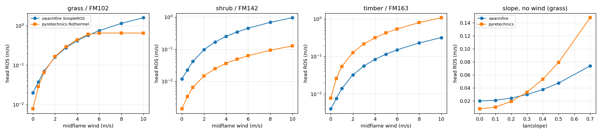
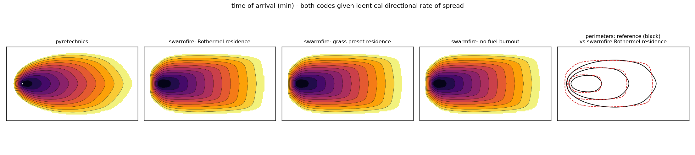

# Validation against pyretechnics

How far is this simulator from a reference implementation, and why.

[`pyretechnics`](https://pyregence.github.io/pyretechnics/) implements Rothermel
(1972) surface spread with the Albini/Anderson elliptical template and an
Eulerian level-set front tracker. It is actively maintained by Spatial
Informatics Group as part of the Pyregence effort, it is the same model
BehavePlus and FARSITE are built on, and — unlike them — it is a library that
can be called cell by cell. That makes it the right yardstick, and the README
has listed measuring against it as a step in *Going realistic* from the start.

Reproduce everything below with:

```bash
pip install -e ".[real,viz,dev]"
python scripts/validate_pyretechnics.py all --plot
pytest tests/test_validation.py
```

## The bottom line first

Uniform fuel, flat ground, point ignition, two hours, 20 m cells, package as
shipped (`SimpleROS`, `fuels.PRESETS`, `CAPropagator` — nothing tuned):

| preset | midflame wind | reference (ha) | swarmfire (ha) | ratio | IoU |
|---|---|---|---|---|---|
| grass | 2 m/s | 102.7 | 101.7 | 0.99 | 0.87 |
| grass | 3 m/s | 222.1 | 189.8 | 0.85 | 0.79 |
| grass | 5 m/s | 306.2 | 240.6 | 0.79 | 0.74 |
| shrub | 2 m/s | 1.0 | 46.9 | 45.1 | 0.02 |
| shrub | 3 m/s | 2.1 | 85.8 | 41.2 | 0.02 |
| shrub | 5 m/s | 4.4 | 147.4 | 33.5 | 0.03 |
| timber | 2 m/s | 61.6 | 7.4 | 0.12 | 0.12 |
| timber | 3 m/s | 122.3 | 12.5 | 0.10 | 0.10 |
| timber | 5 m/s | 224.1 | 20.9 | 0.09 | 0.09 |

Grass lands within 1–21 % of the reference and overlaps it by three quarters.
Shrub and timber are out by more than an order of magnitude — and **every bit of
that is now the rate-of-spread model**, not the front tracker. `PRESETS["shrub"]`
carries a no-wind spread rate 8.6× Rothermel's SH2 and `PRESETS["timber"]` one
about half of TL3's; the propagator faithfully delivers both. Grass agrees only
because its two errors happen to cancel in this wind band (§1).

> **These numbers replace two earlier sets.** As originally measured, grass came
> out at 0.18–0.32× — not because the fuels were better but because three bugs
> in `propagate.py` were fighting each other. Fixing them moved grass to 0.01×
> (worse, briefly, once the bug that was propping the fire up was removed) and
> then to the table above. [§2](#2-front-geometry-the-propagator) is that story;
> it is the reason this document splits physics from front tracking at all.

## Why the comparison is split in two

An under-propagating front and an over-fast ROS produce the same burned-area
curve as a correct simulator. So the two are measured separately:

1. **Point physics.** Does `SimpleROS` return the rate of spread Rothermel
   returns, for the same fuel, moisture, midflame wind and slope? A question
   about `ros/` only.
2. **Front geometry.** Given *identical* directional rate-of-spread fields, does
   `CAPropagator` move the front at that rate, into the right shape? A question
   about `propagate.py` only — and the one that survives replacing `SimpleROS`
   with a real Rothermel model.

`validation.matched_world` is what separates them. Rothermel's wind factor is
`φ_w = C(β/β_op)^−E · U^B` and its slope factor is `φ_s = G·tan²φ` — exactly the
algebraic form `SimpleROS` already uses. Give `SimpleROS` Rothermel's own
coefficients for one fuel and one moisture state and the two agree to float
precision (asserted in `tests/test_validation.py`). Propagate that, and whatever
disagreement is left belongs to the propagator.

## 1. Point physics: `SimpleROS` vs Rothermel



### What is already right

**The ellipse is the reference ellipse, exactly.** `ros/simple.py`'s
`length_to_breadth` is Anderson (1983) with the coefficients expressed in m/s;
`pyretechnics` carries the same formula in mph. `0.1147 × 2.23694 = 0.25657`.
They agree to four decimals at every wind speed below Rothermel's effective-wind
cap. The directional template — `(1−e)/(1−e·cos θ)`, the polar ellipse with the
ignition at a focus — is also character-for-character the reference's.

**The functional forms are right.** `φ_w = a·U^b` and `φ_s = c·tan²φ` are
Rothermel's own forms, and the wind exponent `b = 1.5` is close to the
fuel-dependent 1.36–1.46 Rothermel produces. The 1972 algebra can be dropped in
later without changing the shape of anything downstream.

### What is wrong, and by how much

| | swarmfire | Rothermel (grass/GR2) | (shrub/SH2) | (timber/TL3) |
|---|---|---|---|---|
| `ros0` (m/s) | 0.020 / 0.012 / 0.004 | 0.0078 | 0.0014 | 0.0077 |
| wind `a` | 2.5 (all fuels) | 7.40 | 3.66 | 6.06 |
| wind `b` | 1.5 (all fuels) | 1.46 | 1.39 | 1.36 |
| slope `c` | 5.5 (all fuels) | 36.5 | 19.9 | 28.6 |
| moisture of extinction | 0.12 / 0.20 / 0.25 | 0.15 | 0.15 | 0.30 |
| flame residence (s) | 60 / 150 / 400 | 12.7 | 13.8 | 14.3 |
| effective-wind cap | *none* | 5.25 m/s | 10.6 m/s | 16.3 m/s |

Four separate problems:

* **`ros0` is off by a different factor per fuel, in different directions**:
  grass 2.6× too fast, shrub 8.6× too fast, timber 0.52× too slow. The presets
  were not picked from a fuel model, and it shows.
* **The wind and slope coefficients are fuel-independent when Rothermel's are
  not.** One constant cannot serve GR2 and SH2 — their wind scalars differ by
  2×. The slope constant is 3.6–6.6× too weak everywhere, so steep ground
  under-spreads badly: at a 50 % grade in zero wind, grass spreads at 60 % of
  the reference rate; at 70 %, half.
* **There is no effective-wind limit.** Rothermel stops believing its own wind
  factor above `0.9 I_R`; `SimpleROS` accelerates through it. Above 5.25 m/s on
  grass the head rate runs away — 2.45× the reference at 10 m/s — and, because
  the ellipse is driven off the same uncapped effective wind, so does the shape.
  At 12 m/s `length_to_breadth` returns 20 where the reference holds at 3.41;
  `SimpleROS.max_eccentricity` clamps what is actually realised to L/B ≈ 7.1,
  still twice the reference.
* **Residence times are 5–28× Rothermel's.** This one matters more than it
  looks; see §2.

### The accident worth knowing about

Head rate of spread, grass, flat ground:

| midflame wind | swarmfire | reference | ratio |
|---|---|---|---|
| 0 m/s | 0.0200 | 0.0078 | 2.56 |
| 1 m/s | 0.0700 | 0.0657 | 1.07 |
| 3 m/s | 0.2798 | 0.2940 | 0.95 |
| 5 m/s | 0.5790 | 0.6096 | 0.95 |
| 8 m/s | 1.1514 | 0.6543 | 1.76 |
| 10 m/s | 1.6011 | 0.6543 | 2.45 |

Between 1 and 5 m/s, `SimpleROS` on grass is within 10 % of Rothermel. That is
not calibration: `ros0` is 2.6× too high and the wind factor is 3× too weak, and
across that one band the two errors cancel. Outside it they stop cancelling. The
`grass` demos in this repository sit inside the band, which is why the fires
look about right — and why a validation harness was worth building rather than
eyeballing GIFs.

Shrub and timber have no such band: shrub runs 6.4–7.6× fast at every wind
speed, timber 0.25–0.29× slow at every wind speed.

## 2. Front geometry: the propagator

Both codes given **identical** directional rate of spread (head 0.2940 m/s,
L/B 1.91), grass, 3 m/s midflame, flat, 20 m cells, 2 hours:



| front tracker | head (m/s) | flank (m/s) | back (m/s) | IoU |
|---|---|---|---|---|
| pyretechnics level set | 0.2949 | 0.0429 | 0.0236 | 1.000 |
| *prescribed* | 0.2940 | 0.0433 | 0.0234 | — |
| swarmfire CA, Rothermel residence (12.7 s) | 0.2777 | 0.0577 | 0.0253 | 0.887 |
| swarmfire CA, `grass` preset residence (60 s) | 0.2777 | 0.0577 | 0.0253 | 0.887 |
| swarmfire CA, no fuel burnout | 0.2777 | 0.0577 | 0.0253 | 0.887 |

The three swarmfire rows are identical to four figures, which is the point:
burnout time is a property of the fuel and the front tracker is not entitled to
see it. Head 6 % slow, back 7 % fast, flank 33 % fast, IoU 0.89.

### 2.1 Three bugs, and what they were hiding

**The p-norm differentiated to NaN.** `ignition_drive` combined the eight
neighbour contributions as `x.pow(6).sum().pow(1/6)`. Forward that is fine;
backward, `d/ds [s^(1/6)]` is infinite at `s = 0`, and `s` is exactly zero at
every cell with no lit neighbour — most of the grid. So
`burned_area().backward()` returned NaN for every rollout, and the
differentiable-simulation path the package is built around did not work at all.
`torch.linalg.vector_norm` is forward-identical and defines the subgradient at
the origin as zero.

**Two gates never reached zero.** A sigmoid is never zero, and both gates in
`combustion` were plain sigmoids:

| gate | at the physical zero | meaning |
|---|---|---|
| `sigmoid((ignition − 1) / 0.08)` | `3.7e-6` at zero progress | every cell in the domain burns a little, forever |
| `sigmoid((fuel − 0.03) / 0.03)` | `0.269` at zero fuel | a cell with **no fuel left** reports 27 % of full combustion |

The first is a bias: `burned_area()` accumulated over the whole grid whether or
not anything was alight, and `active()` on an unlit 192×192 grid read 0.13
against a `done` threshold of `1e-3` — so `info["extinguished"]` could never
become true and no rollout ever stopped early. The second was load-bearing in a
way nobody intended, and getting to it is the interesting part.

**The front was sourced from combustion.** `ignition_drive` took its source term
from a neighbour's `intensity` — the rate that neighbour is consuming fuel.
That rate collapses on the flame residence timescale, which is a property of the
fuel and says nothing about the grid. The front needs `cell_size / R` seconds to
cross a cell: 100 s for grass on a 30 m cell, against a flame residence of 13 s.
So the source went dark long before the neighbour it was pushing had arrived.

Those two interacted. The `0.269` floor meant a burnt-out cell never actually
stopped driving, which supplied exactly the missing drive — badly, at a strength
set by the floor rather than by the rate of spread. **The fire was spreading
because burnt fuel never stopped burning.** Removing the floor alone, before
touching the source, took a grass fire at the default 30 m resolution from
spreading at 45 % of its stated rate to not spreading at all: the nearest unlit
cell climbed to `ignition = 0.937` and asymptoted there, never crossing the
arrival threshold.

```
t=  60s  cells ignited:   9   best unlit progress: 0.911   total intensity: 0.4459
t= 300s  cells ignited:   9   best unlit progress: 0.936   total intensity: 0.1125
t=1200s  cells ignited:   9   best unlit progress: 0.937   total intensity: 0.0233
```

The fix is `CAPropagator.front_source`: drive the front from whether a cell has
*ignited* — which `ignition` already records and which does not un-happen —
gated by flammability so that a doused cell stops pushing its neighbours.
Combustion intensity keeps its own job, consuming fuel. Once the two are
separated, front speed stops depending on burnout time:

| residence | residence / cell crossing | head (m/s) | fraction of prescribed |
|---|---|---|---|
| 10 s | 0.15 | 0.2777 | 0.94 |
| 20 s | 0.29 | 0.2777 | 0.94 |
| 60 s | 0.88 | 0.2777 | 0.94 |
| 300 s | 4.41 | 0.2777 | 0.94 |
| ∞ | ∞ | 0.2777 | 0.94 |

and stops depending on the grid, which is the form the same defect took in
practice:

| cell size | crossing time | head (m/s) | fraction | *before the fix* |
|---|---|---|---|---|
| 10 m | 34 s | 0.2796 | 0.95 | 0.95 |
| 15 m | 51 s | 0.2796 | 0.95 | 0.92 |
| 20 m | 68 s | 0.2777 | 0.94 | 0.69 |
| **30 m** | 102 s | 0.2810 | 0.96 | **0.45** |
| 45 m | 153 s | 0.2806 | 0.95 | 0.37 |

`EnvConfig.cell_size` defaults to 30 m, to match LANDFIRE rasters.

**What a latch does *not* cost.** A burnt-out cell keeps radiating, so a fire can
eventually cross a barrier whose suppressant has evaporated with nothing left
burning against it. That is the wrong reason for a barrier to fail and a
minimum-arrival-time propagator would remove it — but it is not introduced here.
The previous formulation had the same artefact through the `0.269` fuel-gate
floor, and the two are within 8 % of each other: on a 2 mm water line across a
5 m/s grass fire the barrier failed at **12720 s before and 11696 s after**.

There is no measure isolating the propagator on which the new version is worse.
Head and back speed, residence independence, resolution independence, perimeter
IoU against the reference, and whether gradients survive at all: every one moved
toward `pyretechnics`. The only composite number that got *worse* is shrub
burned area (13–19× the reference, now 33–45×), and that is `PRESETS["shrub"]`
carrying a spread rate 8.6× SH2's with the compensating brake removed — a
`fuels.py` error the old propagator was hiding, not a new one.

### 2.2 What is still wrong: flanks run about a third too fast

The flank runs at 0.0577 m/s against a prescribed 0.0433 — 33 % fast — while
the head is 6 % slow. The rightmost panel of the arrival-map figure shows the
result: perimeters too fat and too blunt where the reference is a teardrop.

The cause is in `ignition_drive`. Neighbour contributions combine with a p-norm,
which the docstring describes as approximating "the front arrives along the
fastest path". At `p = 6` it does not: a flank cell with two or three lit
neighbours at comparable rates accumulates faster than the single fastest path
would give. Sharpening the norm barely helps, and pushing it far enough to
matter destroys the head instead:

| `pnorm` | head / prescribed | flank / prescribed |
|---|---|---|
| 1 | 1.41 | 2.43 |
| 2 | 1.00 | 1.57 |
| 4 | 0.95 | 1.36 |
| **6** (default) | 0.94 | 1.33 |
| 12 | 0.94 | 1.31 |
| 24 | 0.80 | — (front breaks up) |

There is no setting that gives both. The p-norm is the wrong instrument here,
not a badly-tuned one — a genuine minimum-arrival-time update, or a
differentiable soft-*min* over per-direction arrival times rather than a soft-max
over rates, is what the docstring is actually describing.

### 2.3 And a smaller one: the head loses a few percent per timestep

Well inside the stability limit `check_stability()` reports (27 s for this
scenario), the head rate still drifts with `dt` — 0.2837 m/s at `dt = 2 s`,
0.2778 at 5 s, 0.2508 at 20 s, a 12 % spread. The flanks and back barely move.
`EnvConfig.dt` defaults to 5 s, so this is a percent or two on top of everything
above rather than a headline, but it is the same family of problem: the
propagator's answer depends on how it was discretised. It is also most of the
residual 6 % gap in the head.

## What to do about it, in order

1. ~~Fix the propagator before the physics.~~ **Done.** `front_source` separates
   arrival from combustion, `soft_gate` closes both floors, and
   `torch.linalg.vector_norm` keeps the backward pass finite. Front speed is now
   independent of burnout time and of resolution, and gradients survive the
   simulator. What remains in `propagate.py` is §2.2 and §2.3 — the p-norm and
   the timestep drift — which want a minimum-arrival-time scheme rather than
   more tuning.
2. **Implement `ros/rothermel.py`.** This is now the largest error by far: with
   the front tracker honest, shrub is 33–45× the reference and timber a tenth of
   it, entirely because of `SimpleROS` and `fuels.PRESETS`.
   `swarmfire/validation.py` already extracts every coefficient it needs from
   `pyretechnics` in SI units, and `tests/test_validation.py` has the
   cell-by-cell identity assertions ready to point at it.
3. **Retire the presets in favour of Scott & Burgan fuel models.** `grass`,
   `shrub` and `timber` are stand-ins for GR2, SH2 and TL3 and are wrong by
   different factors in different directions; there is no single correction.
4. **Re-run the suppression study.** Every result in the README predates all of
   this and rests on a fire that did not spread at its own stated rate.

## What this harness is

| file | what it holds |
|---|---|
| `swarmfire/validation.py` | the reference adapter — coefficient extraction, `matched_world`, arrival maps from both codes, axis spread rates, IoU |
| `scripts/validate_pyretechnics.py` | five modes: `coefficients`, `ros`, `front`, `residence`, `area` |
| `tests/test_validation.py` | the identities as exact assertions, the current disagreement as regression guards |

The tolerances in the test file are measurements, not targets. They are there so
that a change in the physics shows up as a failing test and gets looked at, not
so that they pass.

### Comparison conditions

Held fixed everywhere so that differences are attributable to the models:
dead 1/10/100-hour moisture 6/7/8 %, live herbaceous 60 %, live woody 90 %; no
canopy; `FireState.wind` read as midflame wind and inverted to the 10 m wind the
reference's gridded entry points expect via the Andrews (2012) adjustment;
ignition at the grid centre. Spotting, crown fire and fire–atmosphere feedback
are off in the reference, since this package has none.

Three differences are not controlled and are small here: the reference ignites a
single cell where `state.ignite` seeds a soft blob of radius 1.5 cells; the two
codes take different timesteps; and `pyretechnics` works on the slope-tangential
plane where this package works in map projection, so on sloped ground the
matched-ROS bridge is exact only to the projection factor — about 2 % at a 20 %
grade. Every propagation comparison above is on flat ground, where it is exact.
Axis spread rates are read as the slope of a distance-against-arrival-time fit
rather than final extent over elapsed time, which removes the ignition offset
entirely.
